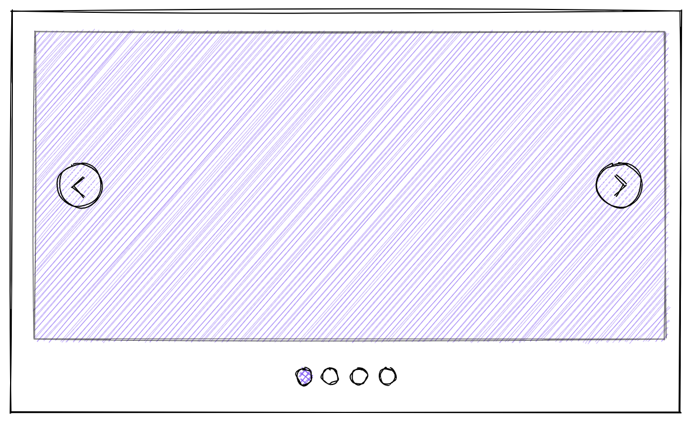
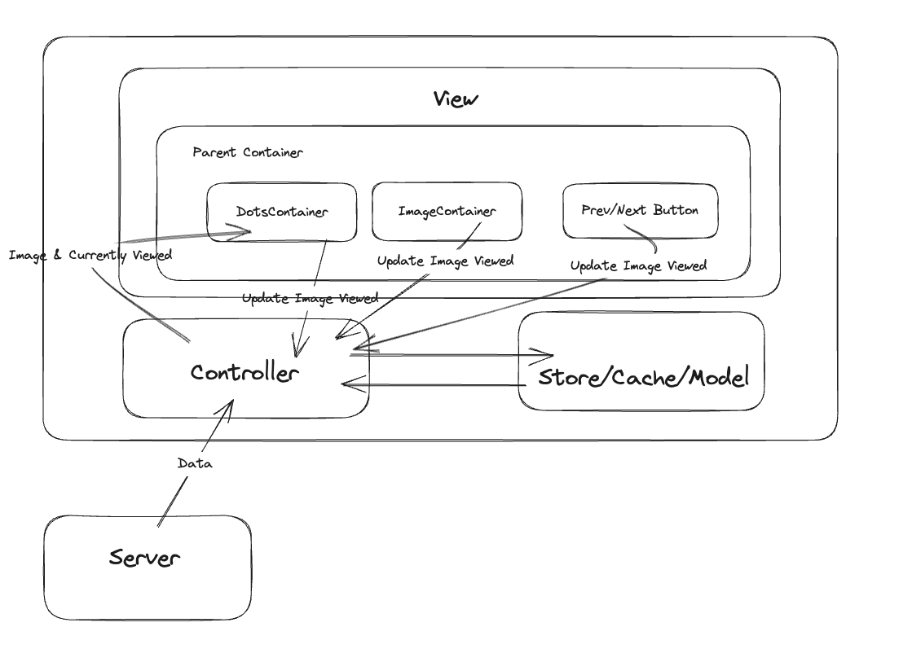

# Image Carousel System Design (FrontEnd)

## Qustion

Design an image carousel component that displays a list of images one at a time, allowing the user to browse through them with pagination buttons.

## RADIO

Try to implement the RADIO framework. Requirement analysis, Architecture, Data models, Interface (API), and Optimisation

## Requirement Analysis

**Functional Requirements**
It's important to start with basic minimum requirements. In order for this carousel to work

- User needs to view the image
- User needs to be able to click `next` and `prev` buttons to go between images
- `next` or `prev` buttons will be disabled if you're at the start/end of the carousel. Alternatively, pressing `next` at the end will jump from the last to the first image
- User needs to be able to click on row of dots to jump to the image. E.g. clicking on the 3rd dot will jump to the 3rd image

**Non-Functional Requirements**
User Experience

- If there are no images, display a no image sign
- If images are of different sizes, we need to make sure they fit within the carousel (e.g. grow them or display "black" background around images that are smaller). We don't want the carousel to jump in size
- Loading images - if some images take longer to load, do we want to display the others while the images taking longer to load displays a "loading" sign

## Architecture

## Database

This is fairly simple. There should just be an array of objects. Each object has the image's URL
`{ image : 'exampleUrl' }`

## Interface (API)

Note that Controller/Parent Container perform the same thing, so we might not need the parent container

We should aim to have the minimum amount of state for each component. Other than the images, all other data is ephemeral data (e.g. which image the user currently viewing)

The Parent Container will have the state of the which image is currently being viewed

## Optimisation

This was covered in the requirement analysis. I think the most important things are
**User Experience / Network**

- If there are no images, display a no image sign
- If images are of different sizes, we need to make sure they fit within the carousel (e.g. grow them or display "black" background around images that are smaller). We don't want the carousel to jump in size
- Loading images - if some images take longer to load, do we want to display the others while the images taking longer to load displays a "loading" sign
- If this application is used throughout the world, we'll need to have CDNs across the world to host and deliver the images
